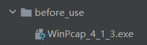

# 笔记
#计算机网络课设
## 使用前

    1. windows下请先安装附录before_use下的winpcap.exe
    
    2. idea使用前先往项目添加jpcap.jar包
    
    3. 使用时出错，请将 before_use 目录下相应的dll文件(重命名成jpcap.dll)复制到jdk/bin目录下

## notes

    列出所有获取的packets. 在table列表中显示的只需要几个关键列就ok
        packet序号，获取的时间，源地址，目的地址，一些信息，
    
    点击某一项后，便用splitpane的第二块显示该项包的详细信息，用jtree显示，
    就像wireshark一样也
    点击jtree里的某一段后，在下方的splipane就显示该字段的16进制内容(高亮)

    1. jlabel 换行 使用html文档
        <html><body>欢迎使用vividCapture网络抓包工具 
        请在下方选择网卡后，点击开始!
        </body></html>

#dev logs

    已简单完成welcome page
    已完成 protocol box 的初始化

    filter过滤功能   输入框要输入什么
    start pause stop 按钮
    后台获取packets 的线程
    table 里面添加 packet
    点击某一项时（加监听）下方的jTree能响应详细数据
    jtree点击某一项时，再下方的数字能响应。

    添加packet的过滤判断
        既没有ip过滤也没有协议过滤
        有ip过滤，没有协议过滤
        没有ip过滤，有协议过滤
        有ip过滤，有协议过滤
        
        先判断协议过滤(?=ALL)，在判断ip过滤(null or isempty)
    

    
